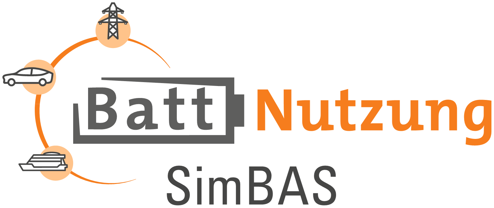

# SimBAS 

Here are the documents created for the public in the SimBAS project. The sources of the individual tools are also linked.

## Content

The complete documentation provides an overview of the individual tools in the toolchain and how they work in combination. 

The individual handouts use practical example applications to show how the toolchain can be used and what the individual tools contribute to the application analysis.

## Project participants

Project participants and their contributed tools are:

ICPD: [RWTH Aachen University – Lehrstuhl für Elektrochemische Energiewandlung und Speichersystemtechnik / Institut für Stromrichtertechnik und Elektrische Antriebe (ISEA)](https://git.rwth-aachen.de/isea/isea-cell-and-pack-database)

BaSD: [Fraunhofer-Institut für integrierte Systeme und Bauelementetechnologie IISB](https://github.com/foxBMS/BaSD)

SimSES: [Technische Universität München (TUM) / Lehrstuhl für Elektrische Energiespeichertechnik (EES)](https://gitlab.lrz.de/open-ees-ses/simses)
